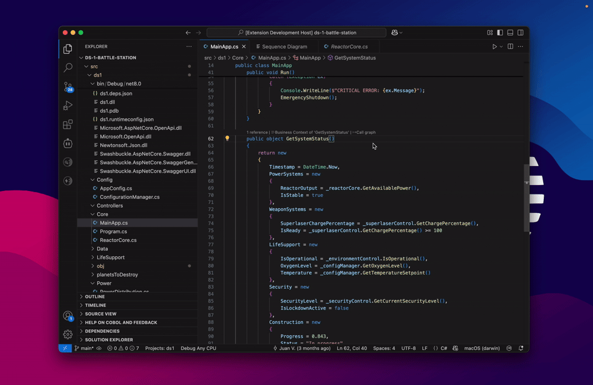

<p align="center">
  <!-- TODO: INSERT COOL LOGO HERE -->
  
  <h1 align="center">Code-to-Knowledge-Graph ✨</h1>
</p>

<p align="center">
  <strong>Unlock the hidden structure and insights within your codebase by transforming it into a powerful, queryable knowledge graph!</strong>
</p>

<p align="center">
  <!-- Badges: Replace placeholders with actual URLs if you set them up -->
  <a href="LICENSE"></a>
  <a href="https://github.com/Bevel-Software/code-to-knowledge-graph/stargazers"></a>
  <!-- Add build status badge if you have CI/CD -->
  <!-- <a href="YOUR_CI_CD_LINK"></a> -->
</p>

---

This project is your gateway to transforming complex source code into structured, queryable knowledge graphs. By leveraging semantic analysis (primarily via VS Code Language Server capabilities and historically through ANTLR), we extract meaningful information about your code's entities, relationships, and architecture. Dive deep into your codebase like never before!


## 🚀 Key Features

*   **Knowledge Graph Generation:** Converts source code from various languages into a rich graph structure.
*   **VS Code Integration:** Primarily utilizes VS Code's powerful language servers for parsing and symbol extraction, providing broad language support out-of-the-box.
*   **Language Agnostic (via VS Code):** The VS Code module aims to support any language for which a good Language Server Protocol (LSP) implementation exists.
*   **Detailed Symbol & Relationship Extraction:** Captures classes, functions, variables, calls, inheritance, implementations, and more.
*   **File System Awareness:** Includes tools for intelligently walking file trees, respecting `.gitignore` patterns.
*   **MinHashing for Similarity:** Implements MinHash for locality-sensitive hashing, useful for detecting near-duplicate code snippets or tracking semantic drift.
*   **(Historical) ANTLR-based Parsing & Querying:** Features a sophisticated, though now **deprecated**, ANTLR-based parsing pipeline with a custom AST Query Language (`bevel_ast_ql`) for fine-grained code analysis.

## 🤔 Why Code-to-Knowledge-Graph?

Understanding large, evolving codebases is a monumental task. This project aims to alleviate that by:

*   **Deep Code Understanding:** Visualize and query relationships between components.
*   **Impact Analysis:** Understand the ripple effects of changes.
*   **Architectural Insights:** Discover design patterns, dependencies, and potential issues.
*   **Foundation for Custom Tooling:** Build linters, documentation generators, or advanced refactoring tools on top of the graph.
*   **AI & LLM Augmentation:** Provide rich, structured context about code to Large Language Models.

## 🛠️ Core Modules

The project is organized into several key modules:

1.  **`vscode/` (Primary & Active):**
    *   Interfaces with VS Code's language services to extract symbols, references, and definitions.
    *   `VsCodeParser.kt`: Orchestrates symbol extraction from files.
    *   `VsCodeConnectionParser.kt`: Infers connections (calls, inheritance, etc.) from symbols.
    *   `languageSpecs/`: Contains language-specific configurations and heuristics to refine VS Code's output.
    *   This is the **recommended and actively developed** approach for parsing.

2.  **`antlr/` (⚠️ Largely Deprecated & Non-Functional):**
    *   Contains ANTLR grammars for various languages (Kotlin, C#, JavaScript).
    *   Includes a custom AST Query Language (`bevel_ast_ql/`) for defining patterns to extract nodes and relationships from ANTLR parse trees.
    *   `QueryBasedAntlrParser.kt` & `ConverterBasedAntlrParser.kt`: Historical parsers using this system.
    *   **Important:** This module underwent a large-scale refactor and is **no longer functional in its current state.** It's preserved for its valuable query language design and potential future reintegration if specific deep-parsing needs arise that VS Code LSP cannot fulfill. The documentation in `docs/` primarily refers to this deprecated system.

3.  **`providers/`:**
    *   `GitignoreAwareFileWalker.kt`: Efficiently traverses project directories, respecting `.gitignore`.
    *   `MinHasher.kt`: Implements MinHash for code similarity analysis.

4.  **`regex/` (⚠️ Deprecated):**
    *   Contains older, regex-based parsers for specific frameworks (e.g., AngularJS). Not actively maintained.

5.  **Root-level Scripts (`combine_*.sh`, `combine_files.py`):**
    *   Utilities to package the codebase itself into a single text file. Useful for providing context to LLMs or for archiving.

## ✨ How It Works (High-Level - VS Code Path)

1.  **File Discovery:** The `GitignoreAwareFileWalker` scans the target project for relevant source files.
2.  **Symbol Extraction (via VS Code):** For each file, the `VsCodeParser` communicates with VS Code (or a compatible LSP client) to request document symbols, workspace symbols, definitions, and references.
3.  **Graph Node Creation:** Extracted symbols (classes, functions, variables, etc.) are transformed into nodes in the knowledge graph.
4.  **Relationship Inference:** The `VsCodeConnectionParser` analyzes the symbol information (e.g., call hierarchies, type definitions, inheritance) to create connections (edges) between nodes.
5.  **Graph Augmentation & Refinement:** Language-specific logic in `vscode/languageSpecs/` can further refine the graph, adding more detailed connections or node properties.
6.  **(Optional) Hashing:** `MinHasher` can be used to generate semantic fingerprints of code blocks or files.

<!-- TODO: INSERT GIF SHOWING CODE BEING PARSED AND GRAPH VISUALIZATION -->
<!-- <p align="center">
  
</p> -->

## 🛠️ How Can This Be Used? Top Use Cases

The **code-to-knowledge-graph** project serves as the foundational engine that powers a comprehensive ecosystem of developer tools designed to unlock insights from complex codebases. Here are the top use cases and tools that leverage this knowledge graph technology:

### 🎯 **1. Interactive Code Visualization & Exploration**
**Tool: [Bevel Neo4j Visualization](https://github.com/Bevel-Software/bevel-neo4j-viz)**

Transform your codebase knowledge graph into stunning, interactive visualizations within VS Code.


### 🧪 **2. AI-Assisted Test Generation**
**Tool: [Bevel Test Generator](https://marketplace.visualstudio.com/items?itemName=bevel-software.bevel-test-generator)**

Leverage the knowledge graph to create comprehensive test prompts for AI coding assistants.


### 📈 **3. Sequence Diagrams & Documentation**
**Tool: [Bevel Software Extension](https://marketplace.visualstudio.com/items?itemName=bevel-software.bevel)**

Generate interactive sequence diagrams and call graphs directly from your codebase analysis.



### 🚀 **4. Custom Tool Development**
**Tool: Direct Integration with Knowledge Graph API**

Build your own analysis tools using the knowledge graph foundation.


### 💡 **Why This Ecosystem Approach Works**

1. **🏗️ Solid Foundation**: The knowledge graph provides a consistent, queryable representation of code structure
2. **🔧 Specialized Tools**: Each tool focuses on specific use cases while sharing the same data foundation  
3. **🤝 Seamless Integration**: Tools work together, with each providing unique value
4. **🌱 Extensible**: Build custom solutions on top of the knowledge graph API
5. **📈 Scalable**: From individual functions to enterprise codebases

Whether you're dealing with legacy systems, complex architectures, or simply want to understand your code better, this ecosystem provides the tools to transform raw source code into actionable insights and beautiful visualizations.

---

## ⚙️ Getting Started

### 🚀 Quick Start (Recommended)

The easiest way to get started is by using the pre-built VS Code extensions that leverage this knowledge graph technology:

1. **Install the main [Bevel Extension](https://marketplace.visualstudio.com/items?itemName=bevel-software.bevel)** from the VS Code marketplace
2. **Open your codebase** in VS Code and run `Bevel: Re-/Analyze Project` from the Command Palette
3. **Explore with additional tools:**
   - Install [Bevel Neo4j Visualization](https://github.com/Bevel-Software/bevel-neo4j-viz) for graph exploration
   - Install [Bevel Test Generator](https://marketplace.visualstudio.com/items?itemName=bevel-software.bevel-test-generator) for AI-assisted testing

This approach gives you immediate access to the knowledge graph capabilities without needing to build from source.

### 🔧 Advanced Usage & Development

If you want to build custom tools or contribute to the core engine:

### Prerequisites

*   Java Development Kit (JDK) 17 or higher
*   Gradle (the project uses the Gradle wrapper, so it will be downloaded automatically)
*   (For `vscode` module functionality) A running instance of VS Code or a compatible LSP server setup that the tool can communicate with (details depend on the specific runner implementation).
*   Python 3 for the `combine_*.sh` scripts (`pip3 install -r requirements.txt`).

### Installation & Build

1.  **Clone the repository:**
    ```bash
    git clone https://github.com/Bevel-Software/code-to-knowledge-graph.git
    cd code-to-knowledge-graph
    ```

2.  **Build the project using Gradle:**
    ```bash
    ./gradlew build
    ```
    This will compile the Kotlin/Java code, run tests, and produce necessary artifacts.

## 🚀 Usage

The primary way to leverage the knowledge graph generation capabilities is by integrating the parsers into your own applications or analysis scripts. The `Factories.kt` file (in `src/main/kotlin/`) provides convenient factory methods to instantiate the core components for the `vscode` module.

Here's a conceptual example of how you might use these factories:

```kotlin
// Example (Conceptual - actual API may vary, check Factories.kt for precise signatures)
import createVsCodeParser
import createVsCodeConnectionParser
// ... other necessary imports from graph_domain, file_system_domain, etc.

fun main() {
    val projectPath = "/path/to/your/codebase" // Ensure this project has a .bevel/port file if not providing commsChannel

    // 1. Create a VsCodeParser instance using the factory
    //    This handles setting up dependencies like communication channels, file handlers, etc.
    val vsCodeParser = createVsCodeParser(projectPath = projectPath)

    // 2. Parse the project to get an initial graph of nodes
    //    The parseToGraphBuilder method returns a GraphBuilder instance.
    val graphBuilder = vsCodeParser.parseToGraphBuilder(listOf(projectPath))

    // 3. Optionally, create a VsCodeConnectionParser to infer more connections
    val vsCodeConnectionParser = createVsCodeConnectionParser(
        projectPath = projectPath,
        // languageSpecification and fileHandler might be shared or re-instantiated
        // commsChannel can be reused if vsCodeParser created one, or a new one can be made
    )

    // 4. Build the final graph and then enhance it with more connections
    //    Note: The exact methods and flow for connection parsing might vary.
    //    The VsCodeConnectionParser typically operates on a Graphlike object.
    var graph = graphBuilder.build(projectPath)
    graph = vsCodeConnectionParser.addOutboundConnections(graph)
    // graph = vsCodeConnectionParser.addInboundConnections(graph) // Or similar methods

    // Now you have 'graph' (a Graphlike object) to work with!
    // You can query its nodes and connections.
    println("Parsed ${graph.nodes.size} nodes and ${graph.connections.getAllConnections().size} connections.")
}
```

<!-- TODO: INSERT GIF SHOWING A QUERY ON THE GENERATED GRAPH -->


## 🤝 Contributing

Contributions are welcome! Whether it's improving the VS Code integration, adding new language-specific handlers, enhancing the graph model, or fixing bugs, your help is appreciated.

1.  Fork the repository.
2.  Create your feature branch (`git checkout -b feature/AmazingFeature`).
3.  Commit your changes (`git commit -m 'Add some AmazingFeature'`).
4.  Push to the branch (`git push origin feature/AmazingFeature`).
5.  Open a Pull Request.

Please make sure your code adheres to the existing style and that all tests pass.

## 📜 License

This project is licensed under the **Mozilla Public License Version 2.0**. See the `LICENSE` file for details.
The `NOTICE` file contains information about licenses of third-party dependencies.

## 🙏 Acknowledgements

*   The **ANTLR** project for their powerful parser generator (though our ANTLR module is currently deprecated).
*   The **Dynatrace hash4j** library for MinHash implementation.
*   The broader **Language Server Protocol (LSP)** community for enabling robust cross-editor language intelligence.
*   All contributors and users of this project.

---

<p align="center">
  Happy Coding & Graphing! 🧑‍💻➡️📊
</p>
